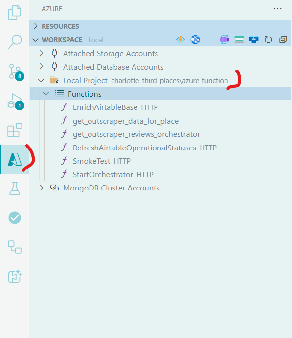
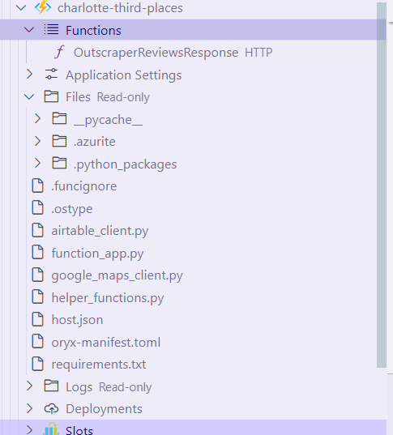

# Azure Function

Documentation on the Azure Function for this project.

## Local Debugging

To debug the Azure Function locally, follow the guidance in the [quickstart](https://learn.microsoft.com/en-us/azure/azure-functions/create-first-function-vs-code-python). Essentially what you do is:

1. Using the a `launch.json` file like the one below debug the `function_app.py` file.
2. Make sure you have the Azure VS Code extension installed.
3. When you do, after debugging you can go to the Azure tab and then `Local Project` and you'll see a `Functions` sub section that lists your functions.
    
4. You can right click any function to invoke it, pasting it your request body if one is required. Local testing does not require the `x-functions-key` header.

```json
{
    "version": "0.2.0",
    "configurations": [
        {
            "name": "Attach to Python Functions",
            "type": "debugpy",
            "request": "attach",
            "connect": {
                "host": "localhost",
                "port": 9091
            },
            "preLaunchTask": "func: host start"
        }
    ]
}
```

## Things to Know

* Testing locally, if you use `venv` you can get weird networking issues tunneling from the virtual environment to the public internet. If you're comfortable with your local environment move to it to overcome some of that.
* You need to place any third-party Python libraries in `requirements.txt` so they're installed in the cloud for use during deployments and production execution.
* To stop Azurite from writing its logs to undesirable locations I set the `Azurite: Location` in settings to the relative path (starting from the C:\ drive) `/GitHub/third-places-data/azure-function/.azurite` The folder is ignored in the `.gitignore`.
* Remember to start and stop Azurite for local testing if you're using local storage.
* To make sure you get to logs read through [this page](https://learn.microsoft.com/en-us/azure/azure-functions/configure-monitoring) and configure your `host.json`
* To understand why `host.json` has an `excluded_types` section check out [this page](https://learn.microsoft.com/en-us/azure/azure-functions/configure-monitoring?tabs=v2#configure-sampling)
* Read through [this](https://learn.microsoft.com/en-us/azure/azure-functions/functions-bindings-http-webhook-trigger?tabs=python-v2%2Cisolated-process%2Cnodejs-v4%2Cfunctionsv2&pivots=programming-language-python#http-auth) page for more details on how HTTP Azure Functions work.
* Read through [this](https://learn.microsoft.com/en-us/azure/azure-functions/function-keys-how-to?tabs=azure-portal) page for details on how Azure Function keys work.
* Read through [this](https://learn.microsoft.com/en-us/azure/azure-functions/durable/durable-functions-types-features-overview) to understand how Durable functions work. For any long running task (more than 3 minutes or so), you need to use a Durable Function. Default Azure Functions will time out.
* To understand Task Hubs in Durable Functions <https://learn.microsoft.com/en-us/azure/azure-functions/durable/durable-functions-task-hubs?tabs=csharp>
* Azure Functions timeout at 10 minutes, 30 minutes on the higher plans. <https://learn.microsoft.com/en-us/azure/azure-functions/functions-host-json#functiontimeout>. You can change this though, or you should be able to, by using a Durable Function and modifying settings in your `host.json`.

## Using Emulated Storage

1. Start the Azurite Blob Service. This can be done from the command panel `CTRL + Shift + P`.
2. Debug `function_app.py` with a `launch.json` file that looks like the [below JSON](#launch-file). Right now this configuration should be setup already in the `.vscode` folder.
3. Navigate to the Azure tab in the left bar and under Workspace expand Local Project. The function should be under there where you can right-click and execute it, providing your own body.

## Using Real Storage

1. Make sure in your `local.settings.json` file you have `AzureWebJobsStorage` set to the connection string of a storage account. The format is `DefaultEndpointsProtocol=https;AccountName=charlottethirdplaces;AccountKey=[AccountKeyHere];EndpointSuffix=core.windows.net`
2. Debug `function_app.py` with a `launch.json`. Right now this configuration should be setup already in the `.vscode` folder.
3. Navigate to the Azure tab in the left bar and under Workspace expand Local Project. The function should be under there where you can right-click and execute it, providing your own body.

## Durable Functions

To test a durable function locally, you need to hit the endpoint of the HTTP trigger function with the name of the orchestrator you're targeting. After that, you get back a bunch of URLs you can poll to check the status.

The response from calling `create_check_status_response` in the HTTP trigger of a Durable Function. Returns endpoints needed to monitor or stop the orchestration.

```json
{
  "id": "118ea5b7831f45c5bd5d6bf5fa4f2ab4",
  "statusQueryGetUri": "http://localhost:7071/runtime/webhooks/durabletask/instances/118ea5b7831f45c5bd5d6bf5fa4f2ab4?taskHub=TestHubName&connection=Storage&code=Redacted",
  "sendEventPostUri": "http://localhost:7071/runtime/webhooks/durabletask/instances/118ea5b7831f45c5bd5d6bf5fa4f2ab4/raiseEvent/{eventName}?taskHub=TestHubName&connection=Storage&code=Redacted",
  "terminatePostUri": "http://localhost:7071/runtime/webhooks/durabletask/instances/118ea5b7831f45c5bd5d6bf5fa4f2ab4/terminate?reason={text}&taskHub=TestHubName&connection=Storage&code=Redacted",
  "rewindPostUri": "http://localhost:7071/runtime/webhooks/durabletask/instances/118ea5b7831f45c5bd5d6bf5fa4f2ab4/rewind?reason={text}&taskHub=TestHubName&connection=Storage&code=Redacted",
  "purgeHistoryDeleteUri": "http://localhost:7071/runtime/webhooks/durabletask/instances/118ea5b7831f45c5bd5d6bf5fa4f2ab4?taskHub=TestHubName&connection=Storage&code=Redacted",
  "restartPostUri": "http://localhost:7071/runtime/webhooks/durabletask/instances/118ea5b7831f45c5bd5d6bf5fa4f2ab4/restart?taskHub=TestHubName&connection=Storage&code=Redacted",
  "suspendPostUri": "http://localhost:7071/runtime/webhooks/durabletask/instances/118ea5b7831f45c5bd5d6bf5fa4f2ab4/suspend?reason={text}&taskHub=TestHubName&connection=Storage&code=Redacted",
  "resumePostUri": "http://localhost:7071/runtime/webhooks/durabletask/instances/118ea5b7831f45c5bd5d6bf5fa4f2ab4/resume?reason={text}&taskHub=TestHubName&connection=Storage&code=Redacted"
}
```

When the Durable Function call is fully complete the final response looks similar to the below. You get this structure from calling the `statusQueryGetUri` returned by the initial call.

```json
{
  "name": "get_place_data_orchestrator",
  "instanceId": "fd1575779e994ba8a9110153f4173a3e",
  "runtimeStatus": "Completed",
  "input": null,
  "customStatus": null,
  "output": "Hello mate. Just verifying things work for now",
  "createdTime": "2024-08-25T22:19:40Z",
  "lastUpdatedTime": "2024-08-25T22:19:42Z"
}
```

For your `local.settings.json` this is the setup I had for valuable logging locally but not too much. Reference <https://learn.microsoft.com/en-us/azure/azure-functions/configure-monitoring?tabs=v2> and <https://github.com/anthonychu/functions-log-suppression>.

```json
{
  "IsEncrypted": false,
  "Values": {
    "AzureWebJobsStorage": "Connection string goes here. Can find this in Azure on the Environment variables tab",
    "FUNCTIONS_WORKER_RUNTIME": "python",
    "AzureWebJobsFeatureFlags": "EnableWorkerIndexing",
    "AZURE_FUNCTION_KEY": "Get this from Azure",
    "WEBSITE_RUN_FROM_PACKAGE": 1,
    "PYTHON_ENABLE_WORKER_EXTENSIONS": "1",
    "AIRTABLE_BASE_ID": "Get from Airtable",
    "AIRTABLE_PERSONAL_ACCESS_TOKEN": "Get from Airtable",
    "AIRTABLE_WORKSPACE_ID": "Get from Airtable",
    "GOOGLE_MAPS_API_KEY": "Get from Google",
    "GITHUB_PERSONAL_ACCESS_TOKEN": "Get from GitHub",
    "OUTSCRAPER_API_KEY": "Get from Outscraper",
    "logging:logLevel:Microsoft": "None",
    "logging:logLevel:Worker": "None",
    "AzureFunctionsJobHost:logging:logLevel:default": "Warning",
    "AzureFunctionsJobHost:logging:logLevel:Host.Function.Console": "None"
  }
}
```

## Available Functions and Endpoints

The Azure Function App exposes several endpoints for interacting with the Third Places data:

### 1. Place Data Refresh

**Endpoint**: `/refresh-place-data`  
**Method**: GET/POST  
**Purpose**: Initiates the refresh of place data for all places  

This function triggers the `get_place_data_orchestrator` to fetch and cache place details, reviews, and photos for all places in the Airtable base.

**Query Parameters**:
* `force_refresh=true`: Bypasses the cache and always fetches fresh data
* `sequential_mode=true`: Processes places sequentially rather than in parallel
* `city=charlotte`: City to use for caching (defaults to "charlotte")
* `provider_type=outscraper`: Type of data provider to use ('google' or 'outscraper')

**Authentication**: Requires the Azure Function key in the `x-functions-key` header.

**Response**: Returns orchestration status URLs that can be used to monitor progress.

### 2. Airtable Base Enrichment

**Endpoint**: `/enrich-airtable-base`  
**Method**: GET/POST  
**Purpose**: Initiates the Airtable data enrichment process  

This function triggers the `enrich_airtable_base_orchestrator` to update all place data in Airtable with the latest information from data providers (Google Maps, Outscraper).

**Query Parameters**:

* `force_refresh=true`: Bypasses the cache and always fetches fresh data
* `sequential_mode=true`: Processes places sequentially rather than in parallel
* `provider_type`: The type of data provider to use (REQUIRED: 'google' or 'outscraper')

**Authentication**: Requires the Azure Function key in the `x-functions-key` header.

**Response**: Returns orchestration status URLs that can be used to monitor progress.

### 3. Operational Status Refresh

**Endpoint**: `/refresh-airtable-operational-statuses`  
**Method**: GET/POST  
**Purpose**: Updates the "Operational" field in Airtable based on the latest data

This function checks if places are still operational (not permanently closed) and updates the Airtable base accordingly.

**Query Parameters**:

* `sequential_mode=true`: Processes places sequentially rather than in parallel
* `provider_type`: The type of data provider to use (optional, 'google' or 'outscraper')

**Authentication**: Requires the Azure Function key in the `x-functions-key` header.

**Response**:

```json
{
  "success": true,
  "message": "Operational statuses refreshed successfully.",
  "data": [
    {
      "place_name": "Example Place",
      "place_id": "ChIJxxxxxxxxxxxxx",
      "record_id": "recXXXXXXXXXXXXXX",
      "update_status": "updated",
      "old_value": "Yes",
      "new_value": "No"
    }
  ],
  "error": null
}
```

### 4. Purge Orchestrations

**Endpoint**: `/purge-orchestrations`  
**Method**: GET/POST  
**Purpose**: Cleans up completed or failed orchestration instances

This function is used for maintenance to purge the history of completed, failed, or terminated orchestration instances.

**Authentication**: Requires the Azure Function key in the `x-functions-key` header.

**Response**:

```json
{
  "message": "Purged orchestration instances.",
  "instancesDeleted": 25
}
```

### 5. Smoke Test

**Endpoint**: `/smoke-test`  
**Method**: POST  
**Purpose**: Verifies the Azure Function is operational

Simple diagnostic endpoint to check if the Azure Function is running correctly.

**Request Body**:

```json
{"House": "Martell"}
```

**Authentication**: Requires the Azure Function key in the `x-functions-key` header.

**Response**:

```json
{
  "message": "The Azure Function is operational and recognizes Dorne. Unbowed. Unbent. Unbroken."
}
```

## Orchestration Functions

The application uses several orchestration functions to manage complex workflows:

### 1. get_place_data_orchestrator

Manages the retrieval of place data:

```python
@app.orchestration_trigger(context_name="context")
def get_place_data_orchestrator(context: df.DurableOrchestrationContext):
    """
    Orchestrator function that coordinates retrieving place data for all places in Airtable.
    """
```

This orchestrator:

* Takes input parameters including `force_refresh`, `sequential_mode`, `city`, and `provider_type`
* Retrieves all third places from Airtable
* Processes places in parallel with controlled concurrency (unless sequential_mode=true)
* Uses batching with MAX_THREAD_WORKERS to avoid API rate limits
* Tracks success/failure for each place
* Returns detailed results of the operation

### 2. enrich_airtable_base_orchestrator

Coordinates the Airtable enrichment process:

```python
@app.orchestration_trigger(context_name="context")
def enrich_airtable_base_orchestrator(context: df.DurableOrchestrationContext):
    """
    Orchestrator function for enriching Airtable base data.
    """
```

This orchestrator:

* Takes parameters including `sequential_mode`, `provider_type`, and `force_refresh`
* Calls the `enrich_airtable_batch` activity function
* Processes the places using the configured data provider
* Updates Airtable with place details, descriptions, parking info, etc.
* Returns detailed results including counts of updated records

## Data Providers

The application uses a provider pattern with two implementations:

### 1. GoogleMapsProvider

Uses the Google Maps Places API directly. Features:
* Retrieves place details using the Places API
* Cannot retrieve reviews directly (limitation of Google's API)
* Retrieves photos using the Places Photos API
* Can validate and find place IDs
* Checks operational status

### 2. OutscraperProvider

Uses Outscraper's API as an alternative data source. Features:
* Provides more comprehensive data including reviews
* Has advanced photo tagging and selection algorithm
* Optimized for Charlotte area with location bias
* Provides operational status information
* Smart handling of addresses and other formatting

## Troubleshooting

Tips on troubleshooting weird stuff with the Azure Function.

If the local deploy from VSCode is showing `getaddrinfo enotfound` as an error messsage, flush your DNS using `ipconfig /flushdns` and wait a minute or two before trying again.

I ran into the issue where you deploy the Azure Function, either from VSCode locally or from a GitHub action, and the deployment goes green, but the Azure Function disappears from the portal. What an annoying issue that is. The reasons for this can be numerous, read through [this thread](https://github.com/Azure/azure-functions-python-worker/issues/1338) and [this thread](https://github.com/Azure/azure-functions-python-worker/issues/1262) and [this thread](https://www.reddit.com/r/AZURE/comments/1cuz049/azure_function_swallows_a_build_error_no_way_to/) for things people have done to fix this issue. The answer is, you could be doing many things wrong, you need to dig deep to figure out which is your issue. In my case, the structure of the directory being uploaded when I started using a GitHub action was wrong. The GitHub action I had initially was generated by Azure using their GitHub integration feature, and it was wrong. Deploying locally from VSCode though I had things working, and so using the "Azure" tab in VSCode (no idea how to do this in the portal) I browsed the function app after a successful local deploy to peep the structure of the folder. Screenshot below. Your end state must be Python packages from your requirements file installed to a `.python_packages` folder in the root, and all other files in the root. I think you could get away with a folder such as `shared_code` to reference modules, but I was having issues with that. This was all with V2 of Python Azure Functions.



## Test Code

All of these endpoints are secured with key authentication. This is assuming you're debugging locally, in which case keys aren't needed.

For posting to `SmokeTest`:

```json
{"House": "Martell"}
```

For posting to `RefreshPlaceData`:

No body required. You can use optional query parameters:

```txt
?force_refresh=true&sequential_mode=true&city=charlotte&provider_type=outscraper
```

For posting to `EnrichAirtableBase`:

No body required. You can use optional query parameters (but provider_type is required):

```txt
?force_refresh=true&sequential_mode=true&provider_type=outscraper
```

For posting to `RefreshAirtableOperationalStatuses`:

No body required. You can use optional query parameters:

```
?sequential_mode=true&provider_type=outscraper
```

For posting to `PurgeOrchestrations`:

No body required.
